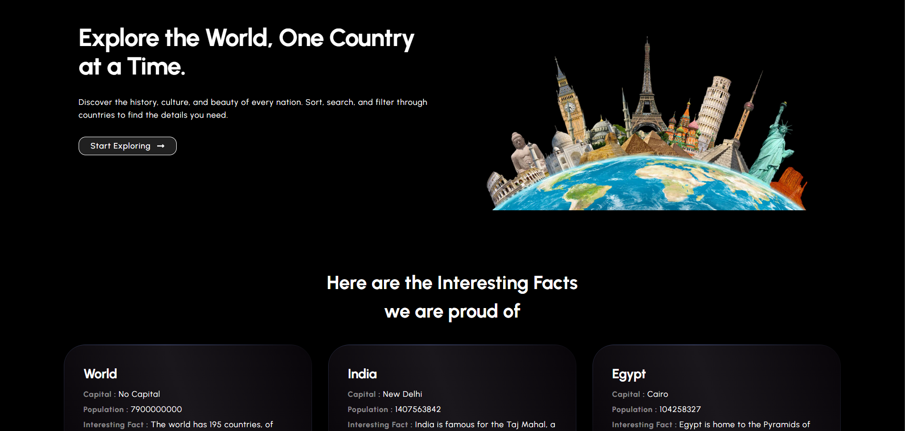
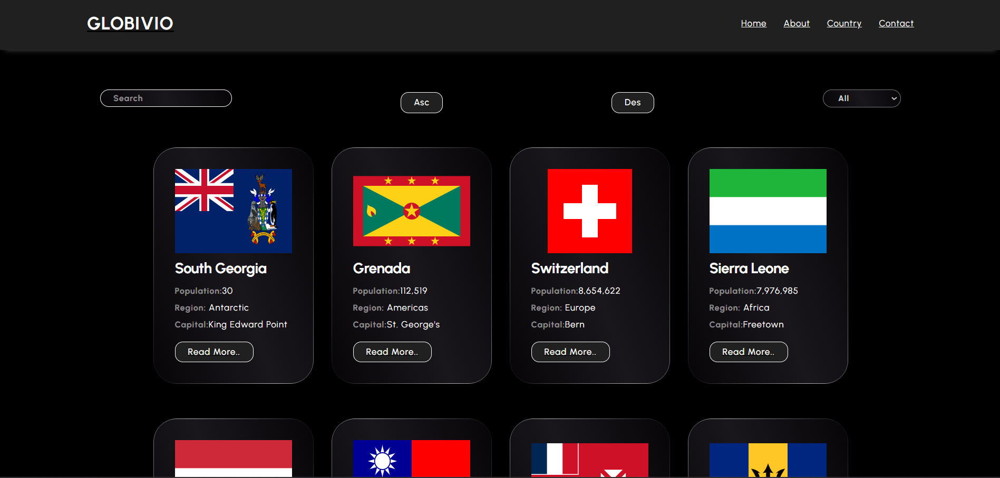

# **Globivio** - Explore the World, One Country at a Time!

Welcome to the **Globivio** project! This web application allows users to search and explore country details, such as population, capital, languages, and currencies. Built using **React** and **Axios**, it dynamically fetches and displays country information from external APIs.





## Features

- **Search for a Country:** Use the search bar to quickly find countries and view their details.
- **View Country Information:** Select a country to view details like population, capital city, languages, and currencies.
- **Responsive Design:** The layout adapts to mobile, tablet, and desktop screens.

## 🛠 Technologies Used

- **React**: JavaScript library for building user interfaces.
- **Axios**: To fetch data from APIs.
- **React Router**: For routing between different components/pages.
- **Netlify**: For easy deployment and hosting.

## Installation

To run this project locally, follow these steps:

1. Clone the repository:

   ```bash
   git clone https://github.com/yourusername/globivio.git
   ```

2. Navigate to the project folder:

   ```bash
   cd globivio
   ```

3. Install the dependencies:

   ```bash
   npm install
   ```

4. Start the development server:

   ```bash
   npm start
   ```

5. Visit `http://localhost:3000` in your browser.

## License

This project is licensed under the MIT License.

---

Feel free to explore and contribute to this project! 🌟
